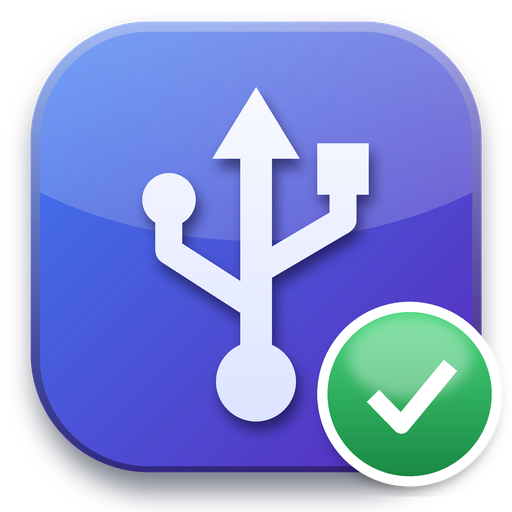

<p align="center">
  
</p>

<h1 align="center">USB Fixer</h1>

<p align="center">
  <b>عیب‌یاب و تعمیرکار هوشمند درگاه‌های USB برای ویندوز</b><br>
  Smart USB troubleshooter &amp; fixer for Windows, with a Persian interface
</p>

<p align="center">
  <a href="https://github.com/kterfan/Usb-error-kt/releases/latest"></a>
  <a href="https://github.com/kterfan/Usb-error-kt/releases"></a>
  <a href="https://github.com/kterfan/Usb-error-kt/actions/workflows/build.yml"></a>
  
  
</p>

<h3 align="center">
  <a href="https://github.com/kterfan/Usb-error-kt/releases/latest/download/USB-Fixer-Setup.exe">⬇️ دانلود نسخهٔ نصبی · Download installer</a>
  &nbsp;|&nbsp;
  <a href="https://github.com/kterfan/Usb-error-kt/releases/latest/download/USB-Fixer.exe">نسخهٔ بدون نصب · Portable</a>
</h3>

<p align="center">
  <a href="#fa">فارسی</a> · <a href="#en">English</a> · <a href="#screenshots">تصاویر / Screenshots</a>
</p>

<p align="center">
  
</p>

---

<a id="fa"></a>
<div dir="rtl">

## 🇮🇷 معرفی

فلش رو وصل می‌کنی و دیده نمی‌شه؟ موس و کیبورد هر چند دقیقه یه بار قطع و وصل می‌شن؟ هارد اکسترنال بعد از Sleep دیگه بیدار نمی‌شه؟ ویندوز می‌گه «Unknown USB Device»؟

**USB Fixer** کل مسیر USB کامپیوترت رو بررسی می‌کنه: از مادربرد، BIOS و چیپست تا درایورها، تنظیمات برق ویندوز و خود دستگاه‌ها. هر مشکلی رو که پیدا کنه **به زبان ساده** توضیح می‌ده و می‌گه کارت چیه. بعد، **فقط با تأیید خودت**، درستش می‌کنه، با نقطهٔ بازیابی و امکان برگرداندن کامل.

## ⬇️ دانلود و نصب

1. **[USB-Fixer-Setup.exe](https://github.com/kterfan/Usb-error-kt/releases/latest/download/USB-Fixer-Setup.exe)** رو دانلود کن.
2. اجراش کن. اگه پنجرهٔ آبی ویندوز (SmartScreen) اومد، بزن **More info** و بعد **Run anyway**. این هشدار فقط به خاطر اینه که فایل امضای دیجیتال پولی نداره.
3. Next ← Install ← Finish. برنامه رو از منوی Start با اسم **USB Fixer** باز کن. برنامه برای رفع مشکلات دسترسی ادمین می‌خواد.

> نسخهٔ بدون نصب: **[USB-Fixer.exe](https://github.com/kterfan/Usb-error-kt/releases/latest/download/USB-Fixer.exe)**. همهٔ نسخه‌ها و هش SHA256 فایل‌ها تو صفحهٔ **[Releases](https://github.com/kterfan/Usb-error-kt/releases)** هست.

**نیازمندی‌ها:** ویندوز ۱۰ یا ۱۱ (۶۴ بیتی). نیازی به نصب پایتون یا چیز دیگه‌ای نیست.

## ✨ امکانات

| بخش | کاری که می‌کنه |
|---|---|
| 🩺 **مشکلات** | هر مشکل با توضیح ساده، علت احتمالی و **یه پیشنهاد مستقیم** («اجرا کن»، «لازم نیست»، «با احتیاط»)، به‌علاوهٔ میزان ریسک و اینکه برمی‌گرده یا نه |
| 🔌 **تست زنده** | دستگاه رو وصل کن تا برنامه واکنش ویندوز رو لحظه‌به‌لحظه ببینه و بگه مشکل از **سخت‌افزاره** (کابل، پورت، برق، خود دستگاه) یا از **ویندوز**؛ اگه قابل رفع باشه، همون‌جا رفعش می‌کنه |
| 🖱️ **دستگاه‌ها** | دستگاه‌ها با **اسم واقعی** (مثلاً «Logitech USB Receiver» به‌جای «USB Composite Device»)، نوع، سازنده و وضعیت، جدا شده به «وصل‌شده‌های تو»، «بخش‌های سیستمی» و «قبلاً وصل بوده» |
| 🧩 **درایورها و BIOS** | جواب مستقیم به «لازمه چیزی آپدیت کنم؟»، نقش هر کنترلر USB به زبان ساده و **چک آنلاین BIOS** از سایت رسمی سازنده |
| 🛡️ **سیستم و نگهبان** | مشخصات مادربرد، BIOS، پردازنده و ویندوز، به‌علاوهٔ **نگهبان ماندگاری** که نمی‌ذاره رفع‌ها بعد از ری‌استارت برگردن |

### 🔍 چیزهایی که شناسایی می‌شه
- **مادربرد و چیپست:** سازنده و مدل برد، نسخه و تاریخ BIOS، پردازنده، سازندهٔ هر کنترلر USB (Intel، AMD، ASMedia، Renesas، VIA…) و درایورش
- **BIOS آنلاین:** برای مادربردهای **ASUS** آخرین نسخه مستقیم از سایت رسمی خونده می‌شه (نسخه، تاریخ، تغییرات، لینک دانلود رسمی). اگه BIOS به‌روز باشه، هشدار بی‌مورد نمی‌ده.
- **خطای دستگاه‌ها:** کدهای 10، 43، 28، 31، 39، 41، 19 و…، «Unknown USB Device (Device Descriptor Request Failed)» و دستگاه‌های شبح (دستگاه‌هایی که قبلاً وصل بودن)
- **برق:** USB Selective Suspend (روی همهٔ پلن‌های برق)، خاموش‌شدن خودکار هاب‌ها، Fast Startup و PCIe Link State
- **حافظه‌های USB:**
  - درایور USBSTOR یا UASP غیرفعال
  - سیاست‌های مسدودکننده و Write Protect
  - دیسک Offline، فقط‌خواندنی یا بدون حرف درایو
  - **پارتیشن RAW** (خراب یا ناخوانا). برنامه هیچ‌وقت فرمت نمی‌کنه و اول راه نجات اطلاعات رو می‌گه.
- **لاگ ویندوز:** خطاهای USB هفتهٔ اخیر
- **مشکلات شناخته‌شدهٔ مادربردها:** مثلاً قطع و وصل USB روی B450، X470، B550 و X570 با Ryzen 3000 و 5000، که فقط برای BIOSهای قبل از رفعش هشدار داده می‌شه

### 🛠️ رفع خودکار (فقط با تیک و تأیید تو)
- ریست دستگاه‌های خطادار
- **ریست کامل USB** (همهٔ کنترلرها)
- حذف دستگاه‌های شبح
- خاموش کردن Selective Suspend، صرفه‌جویی برق هاب‌ها، Fast Startup و ASPM
- فعال کردن USBSTOR و UASP
- برداشتن سیاست مسدودکننده و Write Protect
- آنلاین کردن دیسک و دادن حرف درایو

پنجرهٔ تأیید برای هر کار می‌گه **دقیقاً چی کار می‌کنه**، **چقدر ریسک داره**، **برمی‌گرده یا نه** و **پیشنهاد ما چیه**.

## 🔒 ایمنی و حریم خصوصی
- **اسکن چیزی رو تغییر نمی‌ده.** هیچ تغییری بدون تأیید خودت انجام نمی‌شه.
- **قبل از هر تغییر:** نقطهٔ بازیابی ویندوز ساخته می‌شه و از رجیستری و تنظیمات برق پشتیبان گرفته می‌شه.
- **«برگرداندن تغییرات»** همه‌چیز رو **دقیقاً** به حالت قبل برمی‌گردونه: هر پلن برق جدا، و مقدارهای رجیستری‌ای هم که قبلاً وجود نداشتن پاک می‌شن.
- **هیچ‌وقت فرمت نمی‌کنه** و به اطلاعات دیسک‌ها دست نمی‌زنه.
- **هیچ اطلاعاتی از کامپیوترت فرستاده نمی‌شه.** تنها درخواست اینترنتی، خوندن فهرست عمومی BIOS از `www.asus.com` با اسم مدل مادربرده (فقط HTTPS و فقط همین دامنه). با گزینهٔ `--offline` همین هم خاموش می‌شه.
- کد برنامه کامل و آزاد همین‌جاست.

## ♻️ ماندگاری بعد از ری‌استارت
بعضی تنظیم‌ها ممکنه با آپدیت ویندوز یا نرم‌افزار سازنده برگردن. برای همین:
1. هر رفع روی **همهٔ پلن‌های برق** و به‌صورت سراسری اعمال می‌شه.
2. برنامه **یادش می‌مونه** چه چیزهایی رو درست کرده. اگه چیزی برگشته باشه، با برچسب «دوباره برگشته» نشونش می‌ده.
3. **نگهبان ماندگاری** (اختیاری) موقع ورود به ویندوز فقط همون تنظیم‌هایی رو که با این برنامه درست کردی و برگشتن، دوباره درست می‌کنه. با حذف برنامه، خودش هم پاک می‌شه.

## ❓ سؤالات متداول
<details><summary><b>ویندوز می‌گه فایل ناشناخته است. امنه؟</b></summary>

فایل امضای دیجیتال (Code Signing) نداره و برای همین SmartScreen هشدار می‌ده. کد برنامه کامل همین‌جاست و فایل‌ها مستقیم روی سرورهای خود گیت‌هاب ساخته می‌شن. هش SHA256 هر فایل هم تو صفحهٔ Release هست.
</details>

<details><summary><b>برنامه گفت مشکل سخت‌افزاریه. یعنی چی؟</b></summary>

یعنی ویندوز اصلاً سیگنال درستی از دستگاه نگرفته. معمولاً علتش یکی از این‌هاست:
- کابل خراب یا «فقط شارژ»
- پورت جلوی کیس
- هاب بدون برق
- برق ناکافی برای هارد اکسترنال
- خود دستگاه

پیشنهاد اول: پورت پشت کیس، یه کابل دیگه، و امتحان روی یه کامپیوتر دیگه.
</details>

<details><summary><b>چرا BIOS مادربرد من رو آنلاین چک نکرد؟</b></summary>

فعلاً فقط ASUS فهرست عمومی و قابل‌خوندن BIOS داره. برای سازنده‌های دیگه (MSI، Gigabyte، ASRock و…) برنامه حدس نمی‌زنه و لینک صفحهٔ پشتیبانی رسمی رو می‌ده.
</details>

<details><summary><b>چطور همه‌چیز رو برگردونم؟</b></summary>

دکمهٔ «برگرداندن تغییرات». اگه لازم شد، از نقطهٔ بازیابی ویندوز هم می‌تونی استفاده کنی (برنامه قبل از هر رفع یکی می‌سازه، اگه System Restore روشن باشه).
</details>

<details><summary><b>درایور هم نصب می‌کنه؟</b></summary>

نه، و عمداً. روی ویندوز ۱۰ و ۱۱ درایور استاندارد خود مایکروسافت برای USB 3 توصیه‌شده است. برنامه می‌گه درایور فعلی مناسبه یا نه، و اگه لازم باشه لینک رسمی سازنده رو می‌ده.
</details>

## ⚠️ محدودیت‌ها
- فایل‌ها امضای دیجیتال ندارن (هشدار SmartScreen).
- چک خودکار BIOS فعلاً فقط برای ASUS کار می‌کنه.
- سرعت هر پورت (USB 2 یا 3) و نقشهٔ کامل پورت‌ها هنوز نشون داده نمی‌شه.
- مشکل فیزیکی (کابل، پورت یا دستگاه خراب) با نرم‌افزار درست نمی‌شه. برنامه فقط تشخیصش می‌ده و راهنمایی می‌کنه.

## 👤 سازنده
**عرفان اسمعیل زاده (Erfan Esmailzadeh)** · گیت‌هاب: [@kterfan](https://github.com/kterfan)

اگه مشکلی دیدی یا پیشنهادی داری، یه [Issue](https://github.com/kterfan/Usb-error-kt/issues) بساز. خروجی گزارش برنامه (دکمهٔ «ذخیرهٔ گزارش») خیلی کمک می‌کنه.
اگه برنامه به کارت اومد، با یه ⭐ به ریپو حمایت کن.

</div>

---

<a id="screenshots"></a>
## 📸 تصاویر · Screenshots

| | |
|---|---|
|  <br><sub>مشکلات با پیشنهاد مستقیم (تم تاریک) · Problems with direct advice (dark)</sub> |  <br><sub>تست زنده: سخت‌افزار یا ویندوز؟ · Live test: hardware or Windows?</sub> |
|  <br><sub>تأیید شفاف: کار، ریسک و برگشت‌پذیری · Clear confirmation: action, risk, undo</sub> |  <br><sub>درایورها و چک آنلاین BIOS · Drivers verdict &amp; online BIOS check</sub> |
|  <br><sub>دستگاه‌ها با اسم واقعی · Devices with real names</sub> |  <br><sub>سیستم و نگهبان ماندگاری · System &amp; persistence guard</sub> |

<sub>تصاویر با دادهٔ نمایشی (`--demo`) گرفته شدن · Screenshots use demo data.</sub>

---

<a id="en"></a>
## 🇬🇧 English

**USB Fixer** diagnoses and fixes USB problems on Windows 10/11: devices that aren't detected, random disconnects, "Unknown USB Device (Device Descriptor Request Failed)", external drives that don't wake from sleep, drives without a letter or stuck read-only. It explains every finding in plain language with a direct recommendation, and **changes nothing without your confirmation**.

### Download
- **[USB-Fixer-Setup.exe](https://github.com/kterfan/Usb-error-kt/releases/latest/download/USB-Fixer-Setup.exe)**: installer (recommended)
- **[USB-Fixer.exe](https://github.com/kterfan/Usb-error-kt/releases/latest/download/USB-Fixer.exe)**: portable
- All versions and SHA256 checksums: **[Releases](https://github.com/kterfan/Usb-error-kt/releases)**

The files are not code-signed yet, so SmartScreen may warn: click **More info → Run anyway**. They are built from this source on GitHub's own runners.

### Features
- **Problems:** each finding comes with its likely cause, a direct recommendation, a risk level (safe / low / caution) and whether it can be undone.
- **Live test:** plug a device in and the app watches Windows react in real time. It then tells you whether the problem is **hardware** (cable, port, power, device) or **Windows**, and offers the matching fix.
- **Devices:** real device names instead of "USB Composite Device", grouped as yours, system parts and previously connected.
- **Drivers & BIOS:** a direct "do I need to update anything?" verdict, what each USB controller drives, and an **online BIOS check** against the official ASUS API. No false "old BIOS" warnings when yours is current.
- **Detection:**
  - motherboard, chipset and USB controller vendors (Intel, AMD, ASMedia, Renesas…)
  - device error codes and ghost devices
  - selective suspend, hub power saving, Fast Startup, PCIe ASPM
  - USBSTOR/UASP, storage policies, write protection
  - offline, read-only or letterless disks, and RAW partitions (never formats)
  - recent USB event-log errors
  - known board issues such as the AMD 400/500-series USB dropouts
- **Fixes** (opt-in, after a plain-language confirmation):
  - reset faulty devices, or the whole USB stack
  - remove ghost devices
  - disable selective suspend, hub power saving, Fast Startup and ASPM
  - enable USBSTOR and UASP
  - clear storage policies and write protection
  - bring disks online and assign drive letters
- **Safety:**
  - a restore point and registry/power backups are made first
  - an exact undo, per power plan, that also deletes registry values which did not exist before
  - no formatting, no driver installs, no telemetry
- **Persistence:** fixes are applied to every power plan and machine-wide, remembered, and flagged when Windows reverts them. An optional logon **guard** task re-applies them, and the uninstaller removes it.

### Privacy
Nothing about your PC is sent anywhere. The only network request reads ASUS's public BIOS list for your board model, over HTTPS, to `www.asus.com` only. Use `--offline` to turn it off.

### Command line
```
USB-Fixer.exe                         # GUI
USB-Fixer.exe --scan --report r.txt   # text report to a file
USB-Fixer.exe --offline               # no online BIOS check
USB-Fixer.exe --version               # version and author
```

### Build from source
```bash
pip install -r requirements.txt
python -m usb_fixer            # GUI
python -m usb_fixer --demo     # fake machine, runs on any OS
build.bat                      # Windows: exe (+ installer if Inno Setup 6 is installed)
```

### Tests & CI
- **120+ unit and GUI tests** run on a simulated Windows (`usb_fixer/demo.py`), so they work on any OS: `python -m unittest discover -s tests -t .`
- **Real Windows tests** (`tests_windows/`, opt-in with `USB_FIXER_REAL_TESTS=1`, never on your own PC) run on GitHub's Windows runner:
  - fix → Windows reverts it → guard re-applies → exact undo
  - the scheduled task
  - the live-test scripts
  - the real ASUS BIOS API
- Every push builds the exe, checks its version info and icon, builds the installer, and installs and uninstalls it silently. Every push to `main` publishes the Release.

### Project layout
| Path | What |
|---|---|
| `usb_fixer/snapshot.py` | reads Windows (PowerShell/CIM, powercfg, registry) |
| `usb_fixer/diagnostics.py`, `data/knowledge.json` | findings and board knowledge base |
| `usb_fixer/fixes.py`, `backup.py`, `state.py`, `guard.py` | fixes, backup/undo, persistence, logon guard |
| `usb_fixer/live.py`, `devices.py`, `guide.py`, `bios.py`, `net.py` | live test, device names, driver verdict, online BIOS |
| `usb_fixer/ui/` | Qt (PySide6) interface, light/dark themes, Vazirmatn font |
| `installer/`, `tools/` | Inno Setup script, icon, version info, screenshots |

### Author
**Erfan Esmailzadeh (عرفان اسمعیل زاده)**, [@kterfan](https://github.com/kterfan). Bug reports and ideas are welcome as [issues](https://github.com/kterfan/Usb-error-kt/issues). A ⭐ helps others find the project.

---

<p align="center">
  <sub>Font: <a href="https://github.com/rastikerdar/vazirmatn">Vazirmatn</a> (SIL OFL 1.1, <code>usb_fixer/data/fonts/OFL.txt</code>) · UI: Qt for Python (PySide6)</sub><br>
  <sub>© 2026 Erfan Esmailzadeh · <a href="https://github.com/kterfan">github.com/kterfan</a></sub>
</p>
